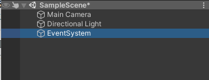
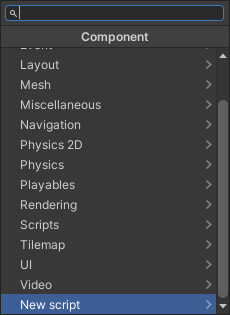
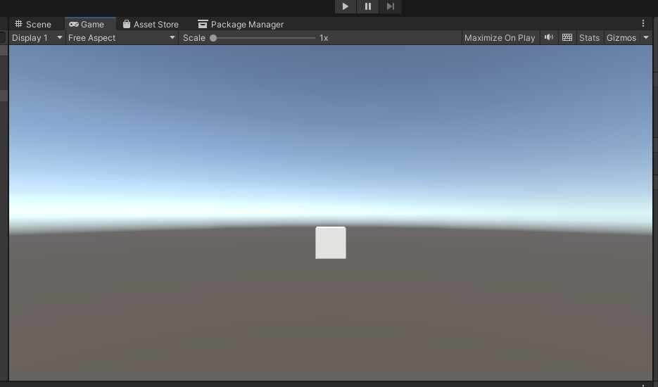
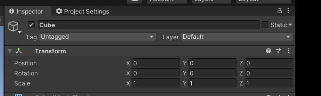
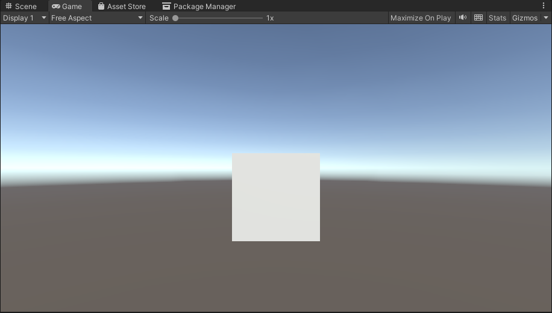

Hierarchy を確認します。

## EventSystem の配置


Hierarchy で上部の＋ボタンから UI > EventSystem を選択します。



EventSystem が配置されます。

## MainCamera に PhysicsRaycaster コンポーネントの配置


MainCamera をクリックします。


MainCamera を選択した状態で Inspector を確認して Add Component をクリックします。


コンポーネントの選択画面が出てきます。


検索エリアに PhysicsRaycaster を検索してクリックして選択します。


PhysicsRaycaster が追加されました。

## Cube の配置


Hierarchy で上部の＋ボタンから 3D Object > Cude の操作をして Cube オブジェクトを配置します。


Cube というオブジェクトが作成されます。


Cube を選択した状態で Inspector を確認して Add Component をクリックします。



New script をクリックします。


Name が聞かれるので NodeRedPostShiba と入力して Create and Add をクリックします。


コンポーネントが追加されたら、C# スクリプトを編集するために、こちらをダブルクリックします。


エディタが起動します。NodeRedPostShiba のスクリプトは以下を記述して保存します。

```csharp
using UnityEngine;
using UnityEngine.EventSystems;

using System.Collections;
using UnityEngine.Networking;
using System.Text;

public class NodeRedPostShiba : MonoBehaviour, IPointerClickHandler
{
    // アクセスする URL
    string urlNodeRed = "ここにサーバーURLを入れる";

    void Start()
    {
        Debug.Log($"Start");
    }

    public void OnPointerClick(PointerEventData eventData)
    {
        // マウスクリックイベント
        Debug.Log($"オブジェクト {this.name} がクリックされたよ！");

        // HTTP GET リクエストを非同期処理を待つためコルーチンとして呼び出す
        StartCoroutine(PostNodeRed());
    }

    // POST リクエストする本体
    IEnumerator PostNodeRed()
    {
        // HTTP リクエストする(POST メソッド) UnityWebRequest を呼び出し
        // アクセスする先は変数 urlNodeRed で設定
        UnityWebRequest request = new UnityWebRequest(urlNodeRed, "POST");

        // 今回は空データを送る
        byte[] bodyRaw = Encoding.UTF8.GetBytes("{}");
        // アップロード（Unity→サーバ）のハンドラを作成
        request.uploadHandler = new UploadHandlerRaw(bodyRaw);
        // ダウンロード（サーバ→Unity）のハンドラを作成
        request.downloadHandler = new DownloadHandlerBuffer();

        // リクエスト開始
        yield return request.SendWebRequest();

        // 結果によって分岐
        switch (request.result)
        {
            case UnityWebRequest.Result.InProgress:
                Debug.Log("リクエスト中");
                break;

            case UnityWebRequest.Result.Success:
                Debug.Log("リクエスト成功");

                // コンソールに表示
                Debug.Log($"responseData: {request.downloadHandler.text}");

                string urlShiba = request.downloadHandler.text;

                // テクスチャ割り当て
                StartCoroutine(GetTexture(urlShiba));


                break;
        }

        request.Dispose();
    }

    IEnumerator GetTexture(string urlTexture)
    {
        // テクスチャを GET リクエストで読み込む。
        UnityWebRequest request = UnityWebRequestTexture.GetTexture(urlTexture);

        // リクエスト開始
        yield return request.SendWebRequest();

        Debug.Log("GetTexture リクエスト開始");

        // 結果によって分岐
        switch (request.result)
        {
            case UnityWebRequest.Result.InProgress:
                Debug.Log("GetTexture リクエスト中");
                break;

            case UnityWebRequest.Result.Success:
                Debug.Log("GetTexture リクエスト成功");

                // テクスチャに割り当て
                Texture loadedTexture = ((DownloadHandlerTexture)request.downloadHandler).texture;

                GameObject.Find("Cube").GetComponent<MeshRenderer>().material.SetTexture("_MainTex", loadedTexture);

                break;
        }
    }
}
```

保存できたら以下のコードに注目します。

```csharp
    // アクセスする URL
    string urlNodeRED = "ここにサーバーURLを入れる";
```

「ここにサーバーURLを入れる」の部分を、今回の URL http://127.0.0.1:1880/api/post/shiba に変更しておきます。

## Cube の大きさを調整



Cube がこのままだと少し小さく確認しにくいので大きさを調整します。



Inspector で Transform を確認します。いま、Scale X:1 Y:1 Z:1 になっています。


Scale X:3 Y:3 Z:3 に変更します。



このような大きさになりました。

これで Unity の準備はできました。

